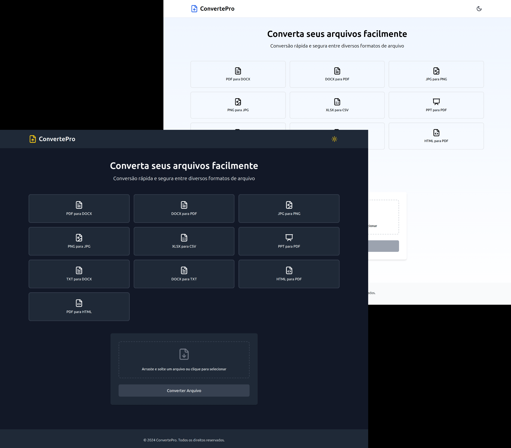

# 🌐 Nome do projeto
<div align="center">
  
</div>

<p align="center">
  <a href="https://github.com/guedes-jr/ConvertPro">
    
  </a>
  <a href="https://github.com/guedes-jr/ConvertPro/issues">
    
  </a>
  <a href="https://github.com/guedes-jr/ConvertPro/network">
    
  </a>
  <a href="https://github.com/guedes-jr/ConvertPro/stargazers">
    
  </a>
  <a href="https://github.com/guedes-jr/ConvertPro/blob/main/LICENSE">
    
  </a>
</p>

## 📝 Sumário

- [Sobre o Projeto](#%EF%B8%8Fsobre-o-projeto)
- [Tecnologias Utilizadas](#-tecnologias-utilizadas)
- [Funcionalidades](#-funcionalidades)
- [Requisitos](#-requisitos)
- [Instalação](#-instalação)
- [Scripts Disponíveis](#-scripts-disponíveis)
- [Estrutura de Pastas](#-estrutura-de-pastas)
- [Contribuindo](#-contribuindo)
- [Licença](#-licença)
- [Contato](#-contato)

## 🛠️Sobre o Projeto

ConvertePro é uma aplicação web que permite a conversão rápida e segura entre diversos formatos de arquivo. Suporta a conversão de documentos, imagens, planilhas e apresentações.

## 🧰 Tecnologias Utilizadas

- [Vite.js](https://vitejs.dev/) - Ferramenta de construção de frontend
- [React](https://reactjs.org/) - Biblioteca de JavaScript para construção de interfaces de usuário
- [Tailwind CSS](https://tailwindcss.com/) - Framework de CSS utilitário
- [Express](https://expressjs.com/) - Framework de servidor web para Node.js
- [Multer](https://github.com/expressjs/multer) - Middleware para manipulação de multipart/form-data
- [Puppeteer](https://pptr.dev/) - Biblioteca para controle de navegadores headless
- [Mammoth](https://github.com/mwilliamson/mammoth.js) - Biblioteca para conversão de DOCX para HTML e texto
- [pdf-parse](https://github.com/modesty/pdf-parse) - Biblioteca para extração de texto de PDFs
- [docx](https://github.com/dolanmiu/docx) - Biblioteca para criação de documentos DOCX

## ✨ Funcionalidades

- Conversão de PDF para DOCX
- Conversão de DOCX para PDF
- Conversão de JPG para PNG
- Conversão de PNG para JPG
- Conversão de XLSX para CSV
- Conversão de PPT para PDF
- Conversão de TXT para DOCX
- Conversão de DOCX para TXT
- Conversão de HTML para PDF
- Conversão de PDF para HTML
- Suporte a modo claro e escuro

## 📋 Requisitos

- [Node.js 20 ou superior](https://nodejs.org/pt/blog/release/v20)

## 🚀 Instalação

### Clonando o Repositório

```bash
git clone https://github.com/guedes-jr/ConvertPro.git ConvertPro

cd ConvertPro
```

## 📦 Scripts Disponíveis

### Servidor

Na pasta `server`, você pode rodar:

- `npm start`: Inicia o servidor Next.js.

### Cliente
Na pasta `client`, você pode rodar:

`npm run dev`: Executa a aplicação em modo de desenvolvimento.
`npm run build`: Compila a aplicação para produção.
`npm start`: Inicia o servidor de produção.

## 📁 Estrutura de Pastas

```plaintext
convertepro/
├── client/
│   ├── public/
│   ├── src/
│   │   ├── App.tsx
│   │   ├── index.tsx
│   │   └── ...
│   ├── package.json
│   └── ...
├── server/
│   ├── converters/
│   │   ├── document.js
│   │   ├── image.js
│   │   ├── presentation.js
│   │   └── spreadsheet.js
│   ├── uploads/
│   ├── index.js
│   ├── package.json
│   └── ...
├── README.md
└── ...
```

## 🤝 Contribuindo

Contribuições são bem-vindas! Sinta-se à vontade para abrir uma issue ou enviar um pull request.

1. Faça um fork do projeto
2. Crie uma nova branch (`git checkout -b feature/nova-funcionalidade`)
3. Commit suas alterações (`git commit -m 'Adiciona nova funcionalidade'`)
4. Faça o push para a branch (`git push origin feature/nova-funcionalidade`)
5. Abra um Pull Request

## 📄 Licença

Este projeto está licenciado sob a Licença MIT - veja o arquivo [LICENSE](LICENSE) para detalhes.

## 📧 Contato

👤 **Seu Nome**

- Github: [@guedes-jr](https://github.com/guedes-jr)
- LinkedIn: [João Guedes](https://www.linkedin.com/in/jo%C3%A3o-guedes-36a440135)
- Email: joao.guedes.developer@gmail.com

---

Desenvolvido com profissionalismo por [João Guedes](https://github.com/guedes-jr) 🤖.